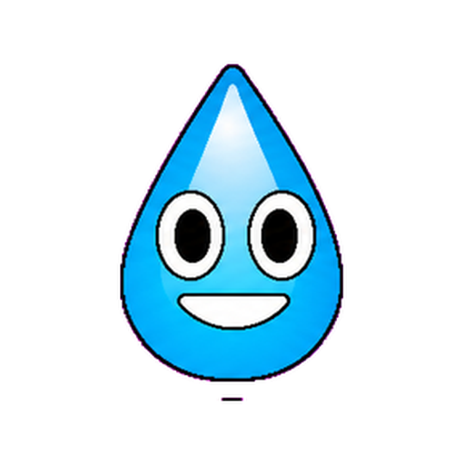
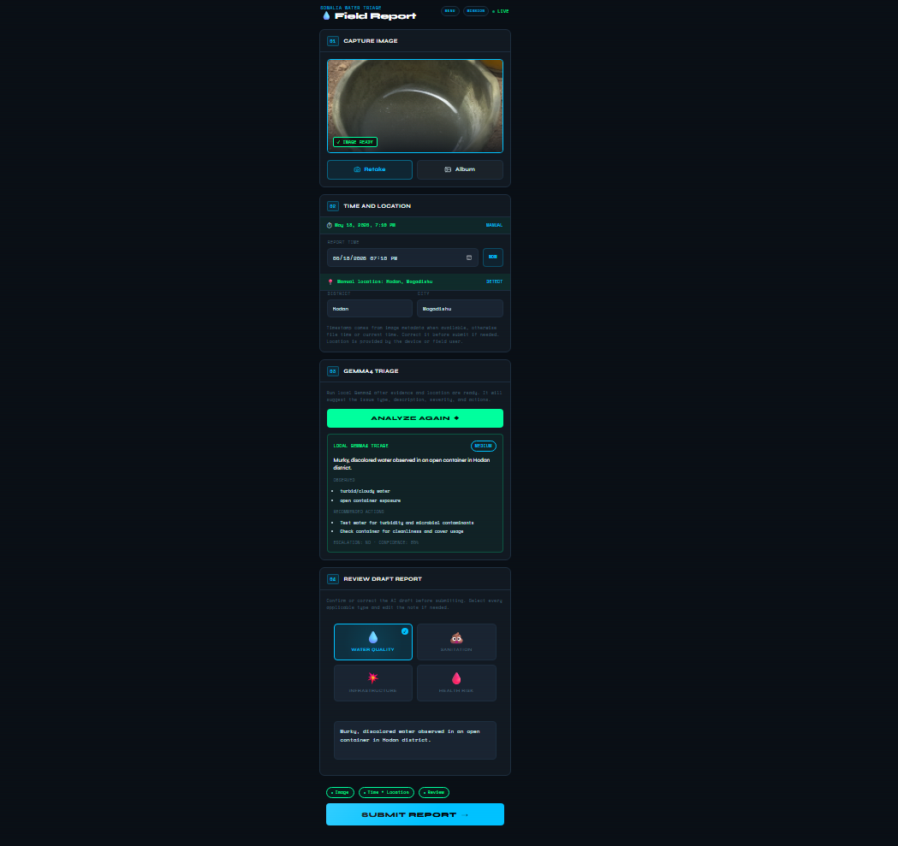
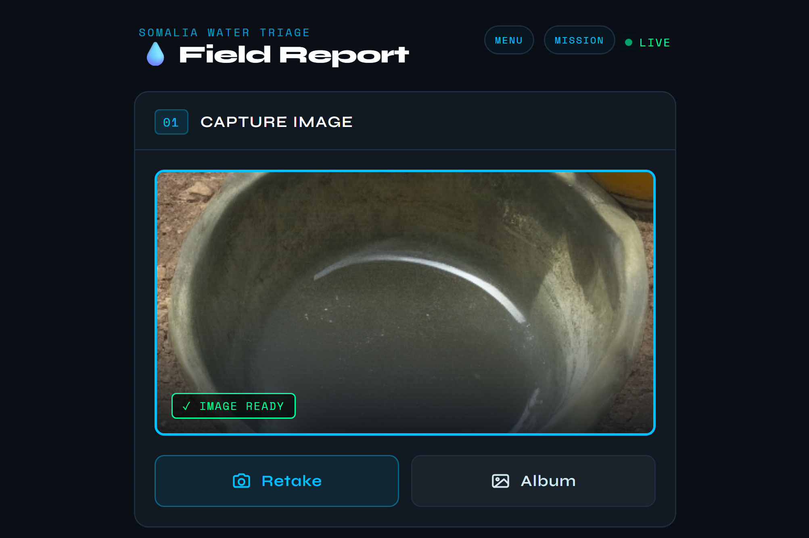
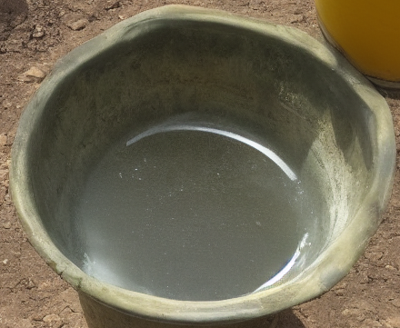
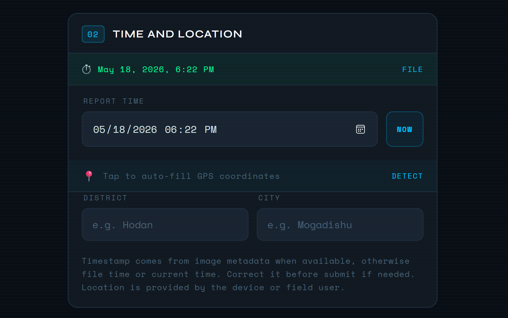
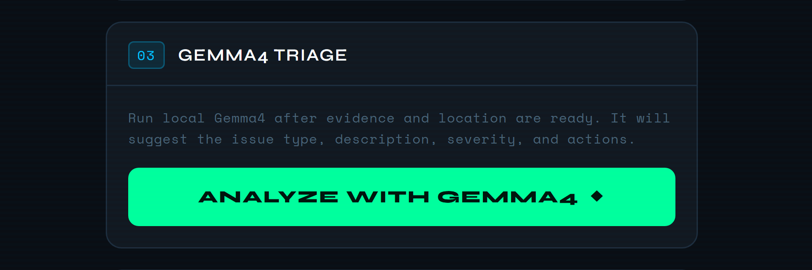
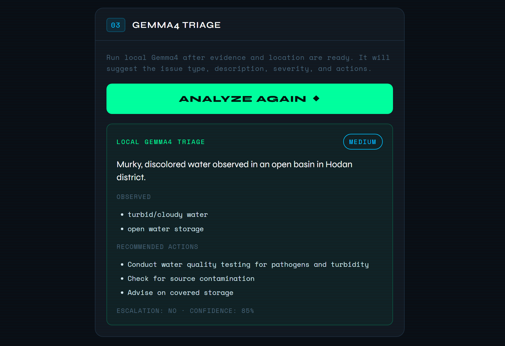
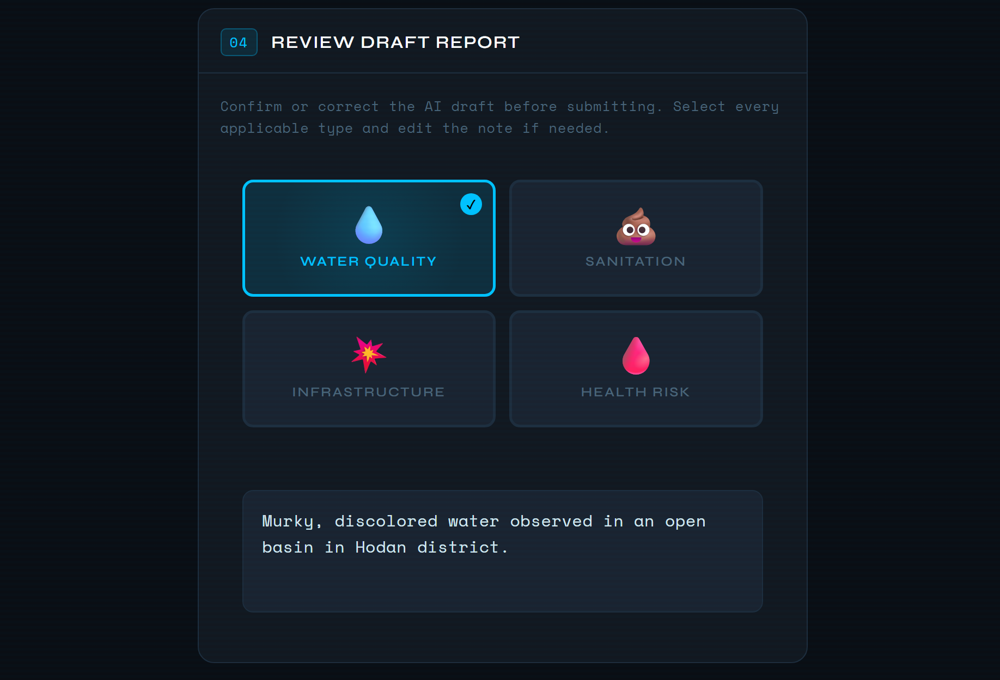

# Clean Drop

  

Clean Drop is a standalone, edge-AI-driven ecosystem designed to ensure reliable access to safe water through real-time monitoring, community-driven reporting, and automated triage. It uses Gemma 4 for offline multimodal analysis and CKAN for centralized data archiving, transforming field images into actionable infrastructure claims.

The platform focuses on high-visibility indicators, specifically Orange Jugs as the primary field icon and Consumer Layer kits such as Cup + Lid, to map water stress across urban, rural, and IDP contexts. The result is a scalable, low-bandwidth friendly system that bridges community needs and official response.

  

## Mission Goal

Remote Somali regions suffer from critical water point outages, quality issues, and supply shortages. Traditional reporting is hindered by low connectivity, low-trust reporting paths, and a lack of objective context.

**Goal:** Ensure reliable access to safe water through real-time level monitoring, rapid response, and community feedback.

**Focus areas:** Water point outages, quality stories, access barriers, supply shortages, and infrastructure damage.

## Clean Drop Mobile Application

The Clean Drop mobile application is the primary touchpoint for community members. It is designed for simplicity and immediate action, with a visual-first workflow that guides users from image capture to reviewed report submission.

  

### Droppy: The AI-Enabled Helper

Droppy is the AI-enabled assistant that guides users through the submission process. Droppy provides real-time feedback, helps ensure captured images are good enough for Gemma 4 analysis, and supports accurate claim categorization. This guidance reduces friction and improves the quality of incoming data from the field.

### Instant Analysis and Issue Tagging

When a user captures a photo of a water point or infrastructure issue, the local Gemma 4 model performs instant analysis. Users can then tag specific issues directly within the app:

- **Water Quality:** Visible contamination or turbidity.
- **Sanitation:** Hygiene-related concerns at water points.
- **Infrastructure:** Broken pipes, damaged pumps, leaking valves, or related failures.
- **Health Risk:** Environmental risks or outbreak-linked water source concerns.

  

### Geolocation and Temporal Tracking

Every submission is enriched with location and time information. This anchors each claim in space and time, allowing Mission Control to generate heatmaps, detect clusters, and track how water stress evolves across regions.

  

### Community Building and Activities

Mission Control can be hosted as a Discord Activity to create a low-barrier entry point for international volunteers. To keep the experience continuous with the app, Droppy can also be made available as a Gemma 4-powered Discord chatbot for project information, moderation, and reporting support.

## Image-First Workflow

Clean Drop prioritizes visual evidence so users with limited literacy or low connectivity can still contribute effectively. The workflow is built for difficult field conditions:

1. A community member captures a water point image in the mobile app.
2. Droppy guides the capture and checks whether the image is usable.
3. Gemma 4 analyzes the image locally for visible indicators such as orange jugs, long queues, water point damage, and environmental risk.
4. The privacy layer anonymizes faces on-device before storage or sync.
5. The system assigns severity and generates a structured draft report.
6. A human reviews the draft and submits the report.
7. Reports queue locally and synchronize with the CKAN archive when connectivity permits.

  

This turns fragile field observations into prioritized, actionable signals for response teams while preserving a closed loop from evidence to verification to dispatch.

## Technical Architecture: Edge to CKAN

The system is optimized for dark-mode-only operations in environments with intermittent power and data.

### Offline-First Capture and Local Processing

Clean Drop runs Gemma 4 locally through `llama.cpp` on edge infrastructure. The current deployment uses the `ggml-org/gemma-4-26b-a4b-it-GGUF:Q4_K_M` multimodal model behind a private `llama.cpp` Vulkan runtime.

The mobile application does not call the raw model endpoint directly. It calls a narrow, same-origin Field Report API that:

- Validates requests and resizes image payloads.
- Sends a constrained prompt to Gemma 4.
- Repairs malformed JSON output when possible.
- Normalizes results against a predefined schema.
- Returns only the essential fields needed for human review.

This local-first design reduces dependence on distant services, keeps raw model access off the public internet, and supports sensitive environments and vulnerable communities. The API boundary enforces operational guardrails by preventing medical diagnoses, invented engineering certainty, and unsupported epidemiological claims. Unclear images receive lower confidence.

Gemma 4 returns strict structured output with fields such as `summary`, `severity`, `category`, `categories`, `observedIssues`, `recommendedActions`, `needsEscalation`, and `confidence`.

  

### Privacy, Compression, and Stale Result Prevention

- **Privacy Engine:** A local privacy layer anonymizes faces before storage or sync.
- **Data Compression:** Images are compressed on-device to reduce sync payloads in low-bandwidth environments.
- **Stale AI Result Prevention:** The interface invalidates previous analysis when the image changes, waits for new image data before enabling analysis, ignores stale model responses, and clears old draft content when a new capture starts.

This prevents an AI result from silently attaching an older analysis to a newer report.

### Centralized Archive: CKAN

Structured reports, issue tags, images, timestamps, and geolocation data synchronize with a centralized CKAN instance. CKAN provides a durable open-source data archive for water resource records, long-term trend analysis, and multi-agency coordination.

Mission Control aggregates reviewed reports and approved demo records into map points, severity distributions, category detections, and operational alerts.

  

## Gemma 4 Fine-Tuning for Object Detection

To improve detection of orange jugs, queues, and water infrastructure, the Gemma 4 multimodal model can be fine-tuned with QLoRA and Unsloth. This allows efficient training on constrained hardware by quantizing the base model to 4-bit while adding small trainable LoRA adapters.

### Training Data

The fine-tuning dataset should include Somali-context water point images annotated with bounding boxes for:

- Orange Jug
- Person, for queue detection
- Pipe
- Pump
- Valve
- Cup + Lid kit
- Water point damage

Captions should describe scene context and associated water issues. For repeatable demos and evaluation, the project includes a 300-record Somalia field-report image dataset with paired images and JSON sidecars covering water-related categories across realistic locations.

### Deployment

Fine-tuned LoRA adapters can be integrated with the base Gemma 4 model on edge devices, enabling more accurate offline object detection and scene analysis within the mobile workflow.

## Mission Control Dashboard and Metrics

Mission Control provides an operational view of the water landscape in Somalia.

Key indicators include:

- **Reports Today:** Real-time report count and change from the previous day.
- **Water Points Active:** Operational water point status.
- **Orange Jug Inventory:** Container and field kit inventory.
- **Average Resolution Time:** Response and repair efficiency.
- **Incident Heatmap:** High-severity incident clusters across districts.
- **Triage Queue:** Prioritized incoming reports by severity, age, and assignment.

## Rollout Plan

1. **Somalia Pilot:** Initial deployment in selected districts, such as Hodan, Mogadishu.
2. **Refine and Scale:** Optimize Gemma 4 prompts and models using pilot feedback.
3. **Expand to Other Communities:** Roll out to additional Somali regions and IDP camps.
4. **Multi-Country Rollout:** Adapt the template for Ethiopia, Kenya, and Djibouti.

## Success Metrics

- Faster resolution time between report and repair.
- More active water points and improved infrastructure uptime.
- Reduced stockouts through better inventory visibility.
- Higher community trust in the reporting and response loop.

## Next Iterations

- Predictive models for water shortage forecasting.
- SMS and IVR fallback reporting for non-smartphone users.
- Supply route optimization for tanker and repair dispatch.
- Discord Activity deployment for volunteer Mission Control workflows.
- Droppy as a Gemma 4-powered Discord chatbot for project support and moderation.

## Conclusion

Clean Drop combines offline AI with an image-first community reporting workflow to create a resilient, privacy-respecting, and actionable water resource management system. CKAN integration ensures the data supports immediate triage while becoming a durable asset for long-term planning and development.

## Repository Assets

The README screenshots are stored in [`notebooks/assets`](notebooks/assets):

| Asset | Purpose |
| --- | --- |
| [`clean-drop-project-icon.png`](notebooks/assets/clean-drop-project-icon.png) | Droppy project icon cropped from the sprite sheet |
| [`00-overview.png`](notebooks/assets/00-overview.png) | Project overview and application framing |
| [`01-capture-image.png`](notebooks/assets/01-capture-image.png) | Field image capture screen |
| [`01a-captured-image.jpg`](notebooks/assets/01a-captured-image.jpg) | Example captured field image |
| [`02-set-time-location.png`](notebooks/assets/02-set-time-location.png) | Time and location confirmation |
| [`03-triage-with-gemma4.png`](notebooks/assets/03-triage-with-gemma4.png) | Gemma 4 triage action |
| [`03a-review-analysis.png`](notebooks/assets/03a-review-analysis.png) | AI analysis review |
| [`04-review-draft-report.png`](notebooks/assets/04-review-draft-report.png) | Final draft report review |

## License

Unless a file states otherwise, the Gemma4Good Kaggle submission materials in
this repository are licensed under the Creative Commons Attribution 4.0
International License (CC BY 4.0). Third-party tools, models, runtimes, and
datasets remain governed by their own licenses and terms.
